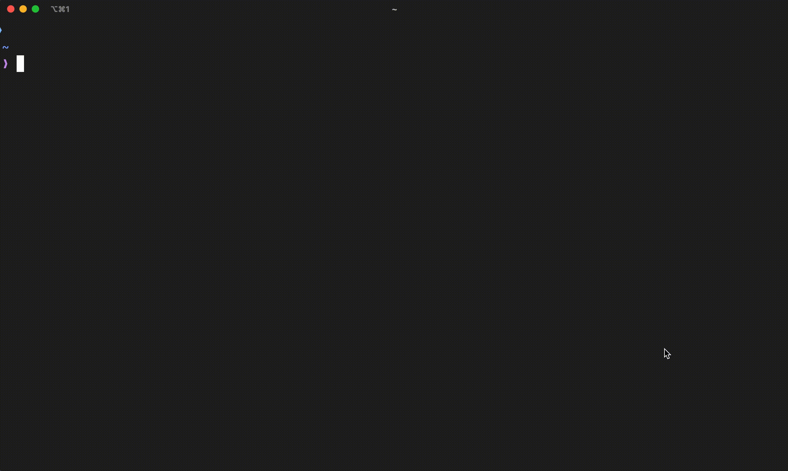

<p align="center"></p>

## Scaffolding your Uplift Project

Using NPX

```bash
npx create-uplift-project@latest [-t template] [folder-name]
```

Then follow the prompts

- Replace `template` with the [template](#template) you want to generate
- Replace `folder-name` with the desired name for your project folder

<p align="center"></p>

## Options

It provides some additional options to customize your project creation projects.

### Template

```sh
--template, -t <template-name>
```

Specify a project template to use

#### Supported Templates

- `react`
- `express`
- `vanilla`

#### Example

```sh
npx create-uplift-project@latest --template react [folder]
```

or using the shorthand

```sh
npx create-uplift-project@latest -t react [folder]
```

###### Created and Developed under [Uplift Code Camp](https://www.upliftcodecamp.com/)
